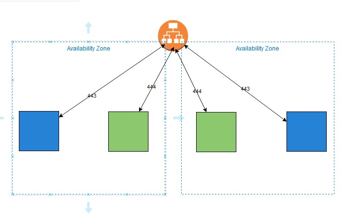
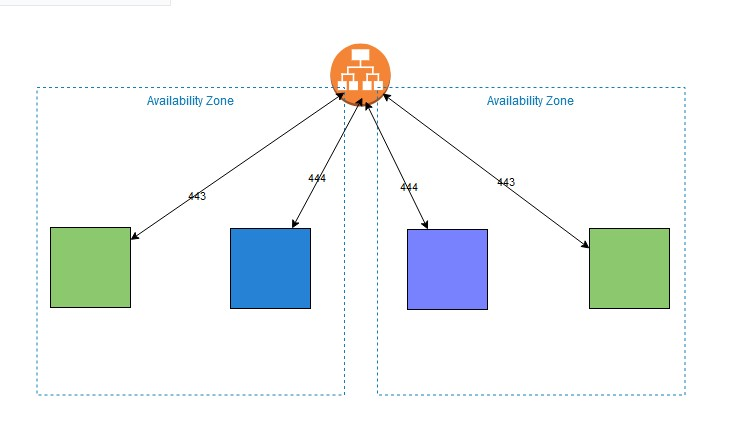

# For the Pipeline we have 2 scenarios:

####	1- Using a deployment with rolling update within the same service by adding 2 updated tasks and draining old tasks, ensure that min. number of tasks are 2, so as not to have downtime:
		Steps:
			1- Configure credentials for Github actions, by using one of 2 ways:
				1- IAM user with access_id and access_key -- then adding them to Github secrets
				2- using Github OIDC, by configuring AWS to allow OIDC to assume a rule to perform desired actions.
			2- Add the Task definition json file to the desired repo., can be extracting it with aws-cli and pull it to the repo.
			3- Assume pipeline steps to be:
				1- Checkout repo
				2- Login to ECR
				3- Build image from Dockerfile and push to ECR
				4- Update the Task definition with the new Image 
				5- Deploy new Task definition
			4- There is an example of using aws.yml file for the pipeline:
			
---------------------------------
####	2- Using a Blue/Green deployment pipeline:
		As shown in diagram:
		
		We'll create the following steps:
			1- Create 2nd listener(B) for (Green deployment) with listening port: (https/444)
			2- Create a TargetGroup(B) for (Green deployment)
			3- Configure credentials for Github actions, by using one of 2 ways:
				1- IAM user with access_id and access_key -- then adding them to Github secrets
				2- using Github OIDC, by configuring AWS to allow OIDC to assume a rule to perform desired actions.
			4- Add the Task definition json file to the desired repo., can be extracting it with aws-cli and pull it to the repo.
		Then create a pipeline:
			1- Checkout repo
			2- Login to ECR
			3- Build image from Dockerfile and push to ECR
			4- Update Terraform files for the ECS, ALB:
				1- create a new task definition with the new image  
				2- create a new service with a new task definition and TargetGroup(B)
			5- Deploy new service and task definition
			6- Test new application with the port ((https/444)
			7- After approval, edit listener(A) to direct traffic to TargetGroup(B), and Listener(B) to direct traffic to TargetGroup(A)
------------------------

